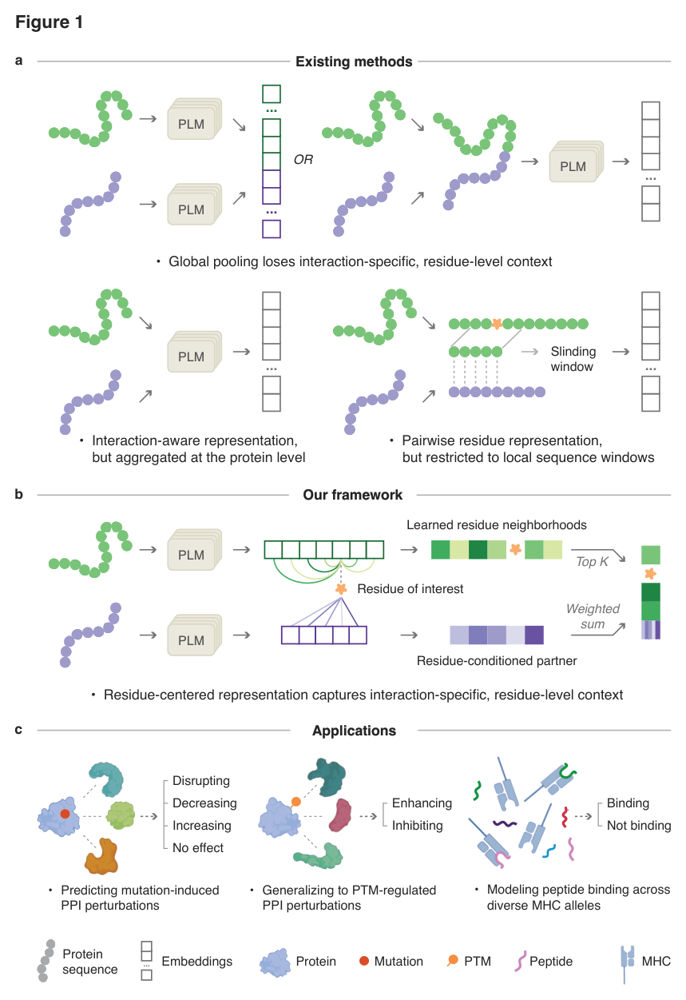
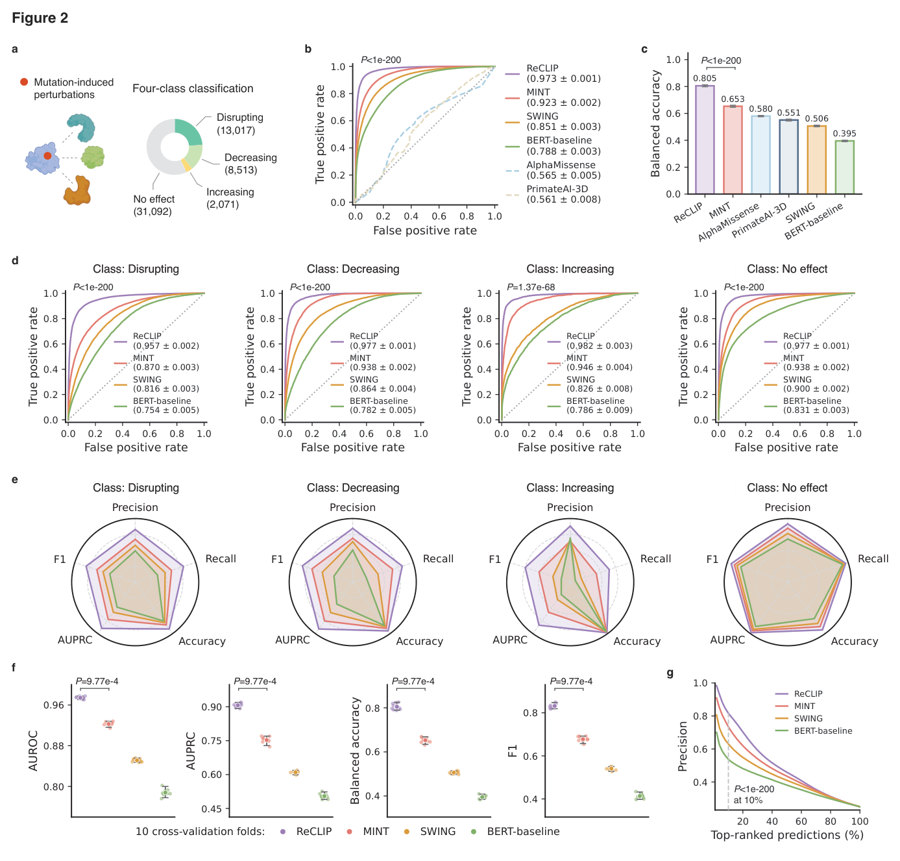
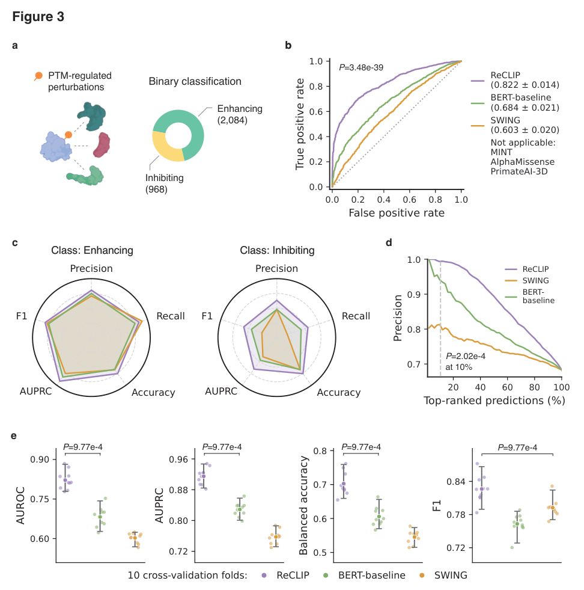
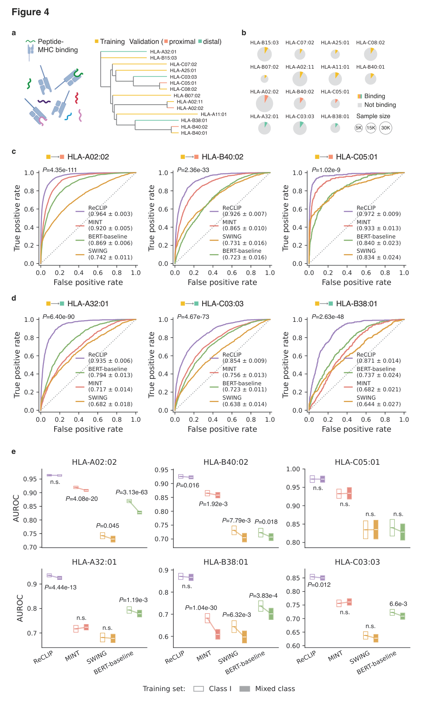
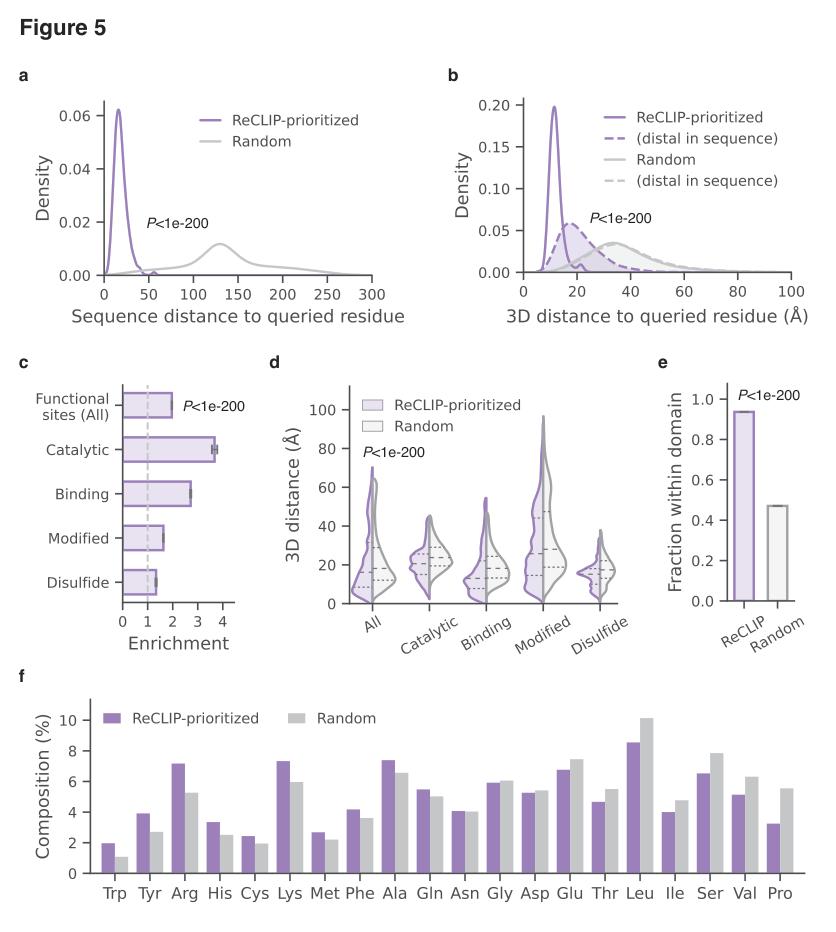

<div align="center">
  <h1>
    
    <span>ReCLIP</span>
    &nbsp;&nbsp;&nbsp;&nbsp;&nbsp;&nbsp;
  </h1>
</div>

<h2 align="center">Learning residue-level context for modeling protein-protein interactions</h2>

ReCLIP (<u>Re</u>sidue-level <u>C</u>ontext <u>L</u>earning for
<u>I</u>nteracting <u>P</u>roteins) is a residue-centered framework for modeling
protein-protein interactions (PPIs). Instead of compressing an interacting
protein pair into a single global embedding, ReCLIP asks which residues around a
site of interest and which partner residues are most informative for the
interaction outcome.

This repository contains the source code, retained baselines, ablations,
compressed task data, and retained analysis plotting bundles used for the
ReCLIP manuscript.

<p align="center">
  
</p>

<p align="center">
  <em>Overview of the ReCLIP framework for residue-centered modeling of mutation-induced, PTM-regulated, and peptide-MHC protein interactions.</em>
</p>

<p align="center">
  <a href="#highlights">Highlights</a> |
  <a href="#current-manuscript-results">Results</a> |
  <a href="#repository-layout">Layout</a> |
  <a href="#installation">Installation</a> |
  <a href="#running-key-pipelines">Examples</a> |
  <a href="#figures-and-ablations">Figures</a> |
  <a href="#data-and-artifacts">Artifacts</a> |
  <a href="#citation">Citation</a>
</p>

## Highlights

- **Mutation-induced PPI perturbations:** four-class prediction of disrupting,
  decreasing, increasing, and no-effect mutations.
- **PTM-regulated PPIs:** binary prediction of enhancing or inhibiting
  post-translational modifications, including cases with no primary sequence
  change.
- **Peptide-MHC binding:** zero-shot evaluation across unseen MHC alleles.
- **Interpretable residue context:** attention-derived residue neighborhoods
  identify structurally and functionally coherent regions around the queried
  residue.

## Current Manuscript Results

These values are taken from the current manuscript draft and should be checked
against the final accepted version before release tagging.

| Task | Dataset / setting | Main result |
| --- | --- | --- |
| Mutation-induced PPI perturbation | IntAct missense perturbation data; four-class classification | AUROC = 0.973, balanced accuracy = 0.805 |
| PTM-regulated PPI perturbation | PTMint enhancing vs inhibiting interactions | AUROC = 0.822 |
| Peptide-MHC binding | Held-out MHC alleles under zero-shot evaluation | AUROC up to 0.972 |
| Residue-context interpretation | ReCLIP-prioritized residues vs matched random residues | Enriched for structural proximity and functional sites |

<details>
<summary>Mutation benchmark</summary>

<p align="center">
  
</p>

</details>

<details>
<summary>PTM benchmark</summary>

<p align="center">
  
</p>

</details>

<details>
<summary>Peptide-MHC benchmark</summary>

<p align="center">
  
</p>

</details>

<details>
<summary>Residue-context interpretation</summary>

<p align="center">
  
</p>

</details>

## Repository Layout

```text
scripts/
  four_classes_mutation/        Mutation pipelines and retained baselines
  ptm/                          PTM pipelines and retained baselines
  peptide/                      Peptide-MHC pipelines and retained baselines
  ablation/                     Lightweight scripts for rerunning ablation settings

analysis/                       Figure 5 residue-context analysis plotting bundle
data/                           Compressed task dataset archives and extraction notes
docs/assets/readme/             README-ready rendered manuscript figures
requirements.txt                Core Python dependencies for repository scripts
```

The main ReCLIP implementations are under the task-level `ReCLIP/`
subdirectories. The release excludes earlier binary mutation pipelines,
legacy cross-attention experiments, ESM-pLM/ESum-pLM folders, and
global-embedding and local automation experiment scripts.

## Installation

Create an isolated Python environment, then install the core dependencies. If
you use CUDA, install the PyTorch build that matches your driver before running
the full feature builders.

```bash
git clone <repo-url>
cd ReCLIP

python -m venv .venv
source .venv/bin/activate
pip install -r requirements.txt
pip install xgboost fairscale omegaconf einops biopython
```

The ReCLIP feature builders also use the MINT codebase and checkpoint. MINT is
an external dependency and is not vendored in this repository. Clone it into the
repository root and keep the checkpoint at `mint/mint.ckpt`, which is the
default path used by the scripts:

```bash
git clone https://github.com/VarunUllanat/mint.git mint
wget -O mint/mint.ckpt \
  https://huggingface.co/varunullanat2012/mint/resolve/main/mint.ckpt
```

If you are running on a machine without CUDA, pass the available `--device` or
`--xgb-device` options where supported. Full feature extraction is substantially
faster on a GPU because both ESM2 and MINT are large protein language models.

Before running the main pipelines, extract the bundled dataset archives from the
repository root:

```bash
tar -xzf data/four_classes_mutation.tar.gz
tar -xzf data/ptm.tar.gz
tar -xzf data/ClassI_Model.tar.gz
tar -xzf data/MixedClass_Model.tar.gz
```

The archives exclude AlphaMissense, AlphaFold, PrimateAI, and local backup
outputs.

## Running Key Pipelines

Run commands from the repository root unless a script-specific README says
otherwise.

### Four-class mutation benchmark

```bash
python scripts/four_classes_mutation/ReCLIP/run_reclip_prediction_save.py \
  --classifier xgb
```

Outputs include fold metrics, metadata, and out-of-fold predictions. The
manuscript benchmark plotting notebooks and compact plotting tables for this
task are temporarily withheld while manuscript revisions are in progress.

### PTM benchmark

```bash
python scripts/ptm/ReCLIP/esm2_ptm_reclip_prediction_save.py \
  --classifier xgb
```

Outputs are written to `Results/` and `ptm_result_reclip/`. The manuscript
benchmark plotting notebooks and compact plotting tables for this task are
temporarily withheld while manuscript revisions are in progress.

### Peptide-MHC benchmark

```bash
python scripts/peptide/ReCLIP/esm2_peptide_reclip_crosspred_save.py \
  --data-set data/ClassI_Model/ClassI_crossval_HLA-A02:02_210.csv \
  --classifier xgb
```

## Figures and Ablations

Task-level manuscript plotting notebooks and compact plotting tables for the
mutation, PTM, and peptide-MHC benchmarks are temporarily withheld from the
public repository while manuscript revisions are in progress.

The ablation plotting notebook, plotting tables, and preview figures are
temporarily withheld while manuscript revisions are in progress. Lightweight
scripts for rerunning layer and top-k ablation settings are kept in
`scripts/ablation/`; see [scripts/README.md](scripts/README.md) and
[scripts/ablation/README.md](scripts/ablation/README.md) for details.

The residue-context Figure 5 analysis bundle is retained under
`analysis/figure_plot/`.

The README images were rendered from local manuscript figure PDFs. The PNG
assets in `docs/assets/readme/` are the files intended for GitHub display; the
source manuscript PDFs are not part of this source release.

## Data and Artifacts

The repository is organized to keep reusable code, compressed task datasets, and
the retained residue-context analysis plotting bundle under version control
while avoiding checkpoints and large local caches. Scripts may create:

- `Results/`
- `Feature_cache/`
- `mutation_result_*`
- `ptm_result_*`
- `peptide_result_*`

These are runtime artifacts and are ignored by Git. The bundled data archives
contain the task inputs needed by the main scripts; MINT checkpoints and trained
task-specific classifier heads are still external artifacts.

Trained task-specific XGBoost classifier heads and large reproducibility
artifacts will be hosted separately on Hugging Face. The artifact repository is
currently private while the release package is being assembled:

https://huggingface.co/RiverZ/reclip

## Citation

The manuscript is currently in preparation. Until the final citation is
available, please cite the repository as:

```bibtex
@misc{reclip2026,
  title = {Learning residue-level context for modeling protein-protein interactions},
  author = {ReCLIP authors},
  year = {2026},
  note = {Manuscript in preparation}
}
```

## Release Checklist

- Add the final manuscript citation and DOI or preprint link.
- Add a repository license at the root level.
- Add the final project logo to `docs/assets/readme/`.
- Confirm which large datasets and checkpoints are included directly, tracked by
  Git LFS, or downloaded through documented setup steps.
