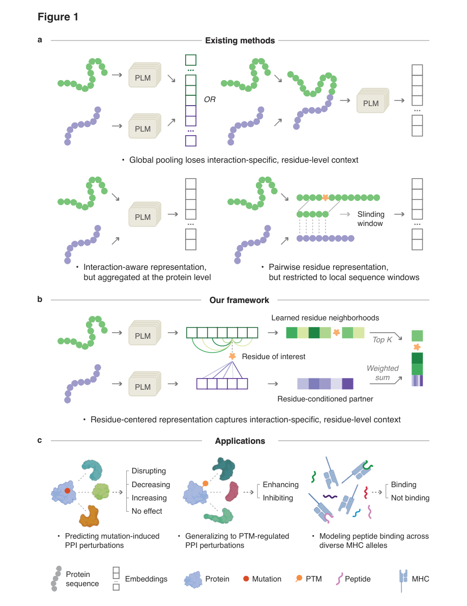
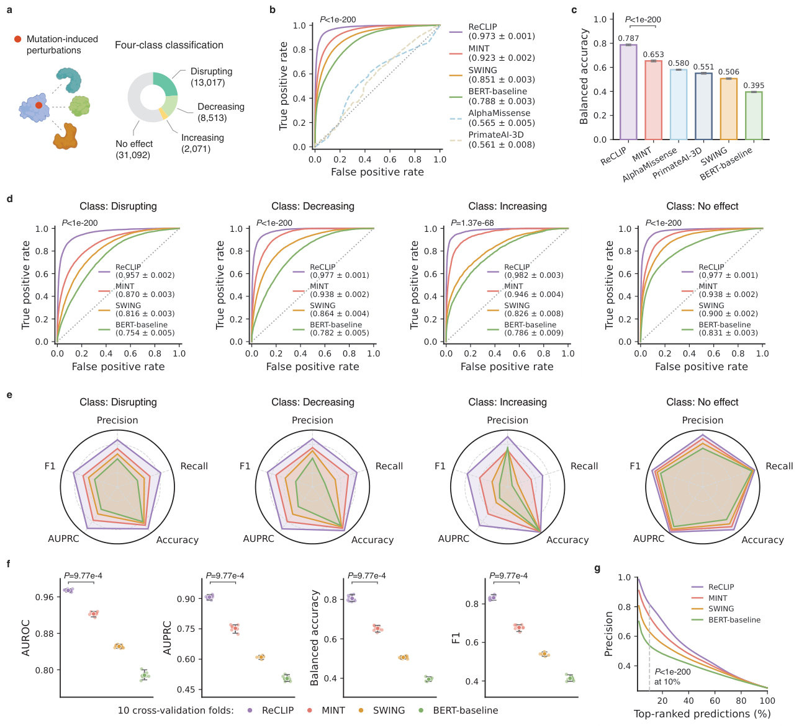
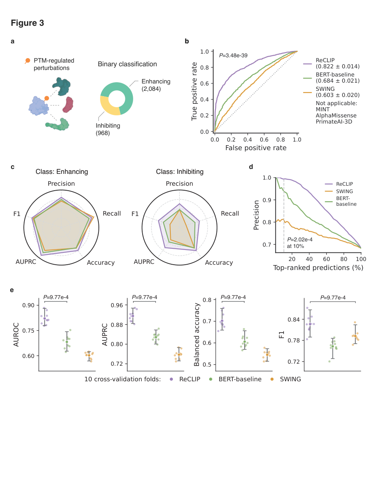
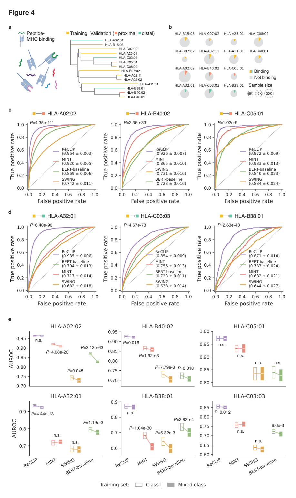
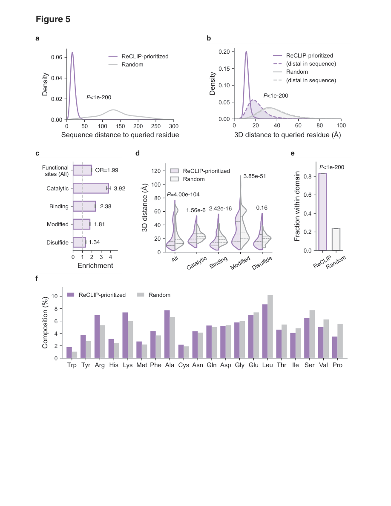
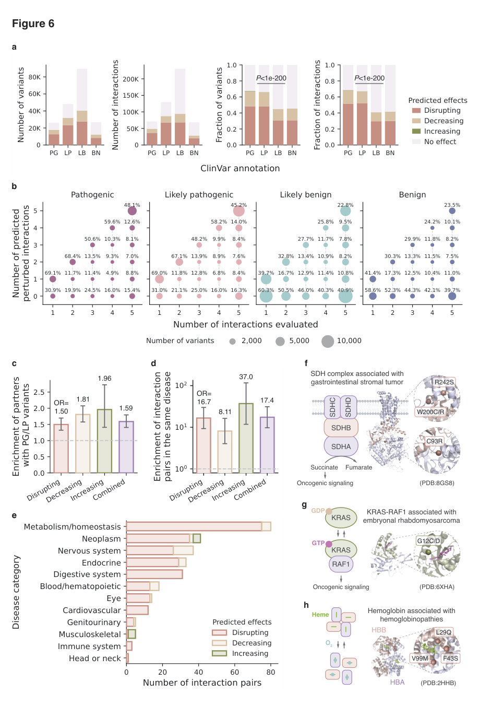

<div align="center">
  <h1>
    
    <span>ReCLIP</span>
    &nbsp;&nbsp;&nbsp;&nbsp;&nbsp;&nbsp;
  </h1>
</div>

<h2 align="center">Learning residue-level context for modeling protein-protein interactions</h2>

ReCLIP (<u>Re</u>sidue-level <u>C</u>ontext <u>L</u>earning for
<u>I</u>nteracting <u>P</u>roteins) is a transformer-based framework for
modeling protein-protein interactions (PPIs) at residue resolution. Instead of
compressing an interacting protein pair into a single global embedding, ReCLIP
asks which residues around a site of interest and which interaction partner
residues are most informative for the interaction outcome.

This repository contains the source code, baseline implementations, ablation
analyses, and compressed task data used for the ReCLIP manuscript.

<br>

<p align="center">
  <strong>Figure 1 | Overview of ReCLIP for residue-centered modeling of protein-protein interactions (PPIs).</strong>
</p>

<p align="center">
  
</p>

<p align="center">
  <a href="#highlights">Highlights</a> |
  <a href="#main-results">Main Results</a> |
  <a href="#repository-layout">Layout</a> |
  <a href="#installation">Installation</a> |
  <a href="#running-key-pipelines">Examples</a> |
  <a href="#data-and-artifacts">Artifacts</a> |
  <a href="#citation">Citation</a>
</p>

## Highlights

- **Mutation effect prediction:** ReCLIP predicts mutation-induced interaction perturbations across four effect classes.
- **PTM effect prediction:** ReCLIP generalizes to interaction perturbations that do not require explicit sequence changes.
- **Peptide-MHC binding prediction:** ReCLIP supports zero-shot prediction across unseen MHC alleles.
- **Biological interpretation:** ReCLIP-prioritized residues capture structurally and functionally coherent residue contexts.
- **Clinical application:** ReCLIP identifies clinically relevant interaction perturbations from human variant annotations.

## Main Results

| ReCLIP application | Key capability | Performance |
| --- | --- | --- |
| Mutation effect prediction | Predict mutation-induced interaction perturbations | AUROC = 0.973 |
| PTM effect prediction | Generalize beyond explicit sequence changes | AUROC = 0.822 |
| Peptide-MHC binding | Robust zero-shot prediction on unseen alleles | AUROC up to 0.972 |

<details>
<summary>Mutation effect prediction</summary>

<br>

<p align="center">
  <strong>Figure 2 | ReCLIP accurately predicts mutation-induced perturbations to PPIs.</strong>
</p>

<p align="center">
  
</p>

</details>

<details>
<summary>PTM effect prediction</summary>

<br>

<p align="center">
  <strong>Figure 3 | ReCLIP generalizes to PTM-regulated interaction perturbations.</strong>
</p>

<p align="center">
  
</p>

</details>

<details>
<summary>Peptide-MHC binding prediction</summary>

<br>

<p align="center">
  <strong>Figure 4 | ReCLIP enables zero-shot prediction of peptide-MHC binding.</strong>
</p>

<p align="center">
  
</p>

</details>

<details>
<summary>Biological interpretation</summary>

<br>

<p align="center">
  <strong>Figure 5 | ReCLIP captures biologically meaningful residue contexts.</strong>
</p>

<p align="center">
  
</p>

</details>

<details>
<summary>Clinical application</summary>

<br>

<p align="center">
  <strong>Figure 6 | ReCLIP identifies clinically relevant interaction perturbations.</strong>
</p>

<p align="center">
  
</p>

</details>

## Repository Layout

```text
scripts/
  four_classes_mutation/        Mutation pipelines and retained baselines
  ptm/                          PTM pipelines and retained baselines
  peptide/                      Peptide-MHC pipelines and retained baselines
  clinvar/                      ClinVar interaction perturbation inference
  ablation/                     Lightweight scripts for rerunning ablation settings

data/                           Compressed task dataset archives and extraction notes
docs/assets/readme/             README-ready rendered manuscript figures
requirements.txt                Core Python dependencies for repository scripts
```

The main ReCLIP implementations are under the task-level `ReCLIP/`
subdirectories. The release excludes earlier binary mutation pipelines, legacy
cross-attention experiments, ESM-pLM/ESum-pLM folders, and global-embedding and
local automation experiment scripts.

## Installation

Create an isolated Python environment, then install the core dependencies. If
you use CUDA, install the PyTorch build that matches your driver before running
the full feature builders.

```bash
git clone https://github.com/SiweiLab/ReCLIP.git
cd ReCLIP

python -m venv .venv
source .venv/bin/activate
pip install -r requirements.txt
pip install xgboost fairscale omegaconf einops biopython
```

The ReCLIP feature builders also use the MINT codebase and checkpoint. MINT is
an external dependency and is not vendored in this repository. Clone it into the
repository root and keep the checkpoint at `mint/mint.ckpt`, which is the
default path used by the scripts:

```bash
git clone https://github.com/VarunUllanat/mint.git mint
wget -O mint/mint.ckpt \
  https://huggingface.co/varunullanat2012/mint/resolve/main/mint.ckpt
```

If you are running on a machine without CUDA, pass the available `--device` or
`--xgb-device` options where supported. Full feature extraction is substantially
faster on a GPU because both ESM2 and MINT are large protein language models.

Before running the main pipelines, extract the bundled dataset archives from the
repository root:

```bash
tar -xzf data/four_classes_mutation.tar.gz
tar -xzf data/ptm.tar.gz
tar -xzf data/ClassI_Model.tar.gz
tar -xzf data/MixedClass_Model.tar.gz
```

The archives exclude AlphaMissense, AlphaFold, PrimateAI, and local backup
outputs.

## Running Key Pipelines

Run commands from the repository root unless a script-specific README says
otherwise.

### Mutation effect prediction

```bash
python scripts/four_classes_mutation/ReCLIP/run_reclip_prediction_save.py \
  --classifier xgb
```

Outputs include fold metrics, metadata, grouped predictions, and out-of-fold
predictions.

### PTM effect prediction

```bash
python scripts/ptm/ReCLIP/esm2_ptm_reclip_prediction_save.py \
  --classifier xgb
```

Outputs are written to `Results/` and `ptm_result_reclip/`.

### Peptide-MHC binding prediction

```bash
python scripts/peptide/ReCLIP/esm2_peptide_reclip_crosspred_save.py \
  --data-set data/ClassI_Model/ClassI_crossval_HLA-A02:02_210.csv \
  --classifier xgb
```

### ClinVar interaction perturbation inference

```bash
python scripts/clinvar/cross_attention_IntAct_mutation_xgb_inference_clinvar.py \
  --input <clinvar_interactions.tsv> \
  --model <trained_xgboost.pkl> \
  --output <scored_interactions.tsv> \
  --sep "\t"
```

## Data and Artifacts

The repository is organized to keep reusable code and compressed task datasets
under version control while avoiding checkpoints and large local caches. Scripts
may create:

- `Results/`
- `Feature_cache/`
- `mutation_result_*`
- `ptm_result_*`
- `peptide_result_*`

These are runtime artifacts and are ignored by Git. The bundled data archives
contain the task inputs needed by the main scripts; MINT checkpoints and trained
task-specific classifier heads are external artifacts.

Release artifacts are hosted separately on Hugging Face:

https://huggingface.co/RiverZ/reclip

## Citation

The manuscript is currently in preparation. Until the final citation is
available, please cite the repository as:

```bibtex
@misc{reclip2026,
  title = {Learning residue-level context for modeling protein-protein interactions},
  author = {ReCLIP authors},
  year = {2026},
  note = {Manuscript in preparation}
}
```
